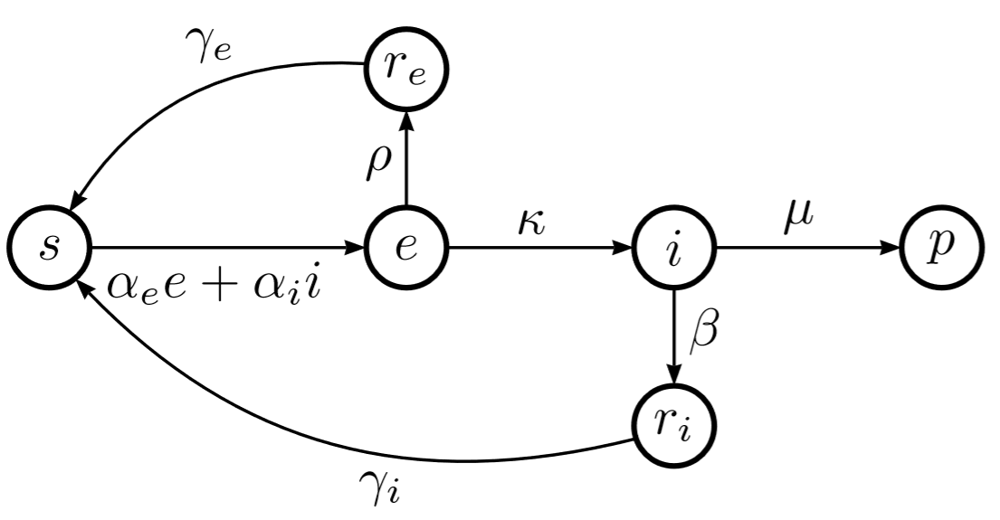

# Mathematical Modeling of Epidemic Diseases
## A Case Study of the COVID-19 Coronavirus

The Coronavirus COVID-19 has taken the lives of several thousands worldwide and locked-out many countries and regions, with yet unpredictable global consequences. In this ongoing research we study the epidemic patterns of this virus from a mathematical modeling perspective. The objective of this work is to provide researchers a better understanding of spreading patterns of such diseases and to clarify the common misunderstandings in this regard. The latest version of a technical report on this research is available at: https://arxiv.org/abs/2003.11371. This Git repository is dedicated to sharing source codes for modeling and simulation of such epidemic diseases.
#coronavirus #CoronavirusOutbreak #Epidemic #covid19outbreak
