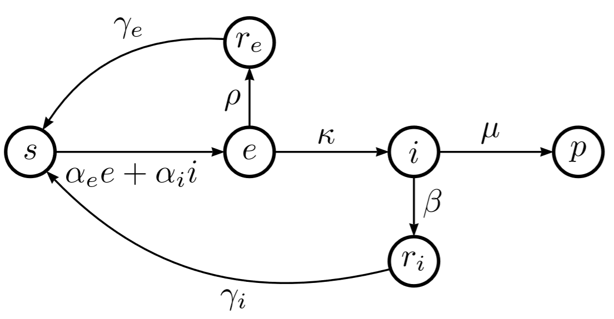

# Epidemic modeling · MATLAB & Python

**Reza Sameni · Emory University**

A documented codebase for compartment models, epidemic growth estimation, extended
Kalman filtering and smoothing, and non-pharmaceutical intervention (NPI) control.
Python numerical functions live in `src/epidemic_modeling`; notebooks import them.
MATLAB provides the same model equations, a matching estimation and control pipeline, and
function-based tests. The included COVID-19 datasets and figures are historical
research examples, not current surveillance data.



## Start with Python

From the repository root:

```bash
python3 -m venv .venv
source .venv/bin/activate             # Windows: .venv\Scripts\activate
python -m pip install -e ".[notebooks,dev]"
python -m pytest
jupyter lab notebooks
```

Select the Python environment where the package was installed. All seven notebooks
run offline after installation. Executed outputs are included, along with HTML
previews under `reports/notebooks/` for review without Jupyter.

| Notebook | Topic | Example |
| --- | --- | --- |
| [00 · Start here](notebooks/00_start_here.ipynb) | Repository map and conventions | Check shapes, units, and citations |
| [01 · Compartment models](notebooks/01_compartment_models.ipynb) | SEIRP, healthcare saturation, controlled SI | Change a rate; check mass conservation |
| [02 · Growth estimation](notebooks/02_growth_estimation.ipynb) | Lag ratios, log regression, nonlinear fitting | Compare causal and centered estimates |
| [03 · Kalman estimation](notebooks/03_kalman_estimation.ipynb) | EKF/EKS, missing observations, SI-alpha | Compare filtered and smoothed estimates |
| [04 · Intervention control](notebooks/04_intervention_control.ipynb) | Two-pass training, forecasting, bounded NPI control | Inspect the case/cost tradeoff |
| [05 · Historical data](notebooks/05_historical_data.ipynb) | Oxford CSVs and held-out assessment | Audit preprocessing and avoid leakage |
| [06 · Spatial models and layers](notebooks/06_spatial_models_and_layers.ipynb) | Diffusion, reflected motion, learnable activations | Test stability and supplied weights |

## Start with MATLAB

MATLAB R2021b or newer is recommended. From the repository root:

```matlab
addpath('matlab');
root = setup_paths();
results = runtests(fullfile(root, 'matlab', 'tests'));
assert(all([results.Passed]));
demo_compartment_models;
demo_growth_estimation;
demo_kalman_estimation;
demo_intervention_control;
demo_historical_data;
demo_spatial_models;
```

Core models, generic EKF, spatial demos, and the upgraded NPI pipeline use base
MATLAB. `rt_exp_fit_nonlin_ls` uses `nlinfit` (Statistics and Machine Learning
Toolbox); the two learnable MATLAB layer classes use Deep Learning Toolbox.
Those optional test cases are skipped with an explicit assumption when a toolbox
is unavailable. Historical research scripts are retained as text under
`docs/historical_matlab/`; the examples above use local data and paths.
Do not add `matlab/codegen` recursively to the MATLAB path: its standalone helper
names overlap the nested callbacks in the main library.

## MATLAB/Python parity

The paired functions retain MATLAB's variables-by-time layout, Euler grids, and
legacy growth output definitions. Scalar rate schedules and explicit shared noise
are supported in both languages. Random streams and optimizer internals are not
expected to be bitwise identical. The upgraded NNLS pipeline uses the same cyclic
coordinate-descent algorithm in both languages.

Run MATLAB's `export_parity_results` and then:

```bash
python scripts/compare_matlab_python.py reports/matlab_results.mat
```

This compares actual MATLAB outputs against Python for model trajectories,
growth fitting, EKF/EKS (including second order), reverse-time filtering,
controlled filtering, layers, spatial models, and the upgraded NPI pipeline.
The delivered build passed 35 Python tests, 18 MATLAB tests, and comparisons
of 124 actual MATLAB/Python arrays. See [validation](docs/validation.md) for
versions, tolerances, and optional-feature coverage.

## Review and extend

- [API contracts and parameter glossary](docs/api.md)
- [Migration map and deliberate fixes](docs/migration.md)
- [Examples guide](docs/examples_guide.md)
- [Validation evidence](docs/validation.md)
- [Historical data provenance](data/README.md)
- [Bibliography](references.bib) and [technical report](docs/xprize_detailed_technical_report.pdf)

Re-execute/export notebooks with `python scripts/execute_notebooks.py`.
Build a clean replacement archive with `python scripts/package_release.py`.
The archive excludes virtual environments, caches, Git metadata, and itself.
No push, commit, or remote repository modification is required.

## References

1. Sameni, R. (2020). *Mathematical Modeling of Epidemic Diseases; A Case Study of
   the COVID-19 Coronavirus*. [arXiv:2003.11371](https://arxiv.org/abs/2003.11371).
2. Sameni, R. (2022). *Model-Based Prediction and Optimal Control of Pandemics by
   Non-Pharmaceutical Interventions*. IEEE Journal of Selected Topics in Signal
   Processing, 16(2), 307–317. [doi:10.1109/JSTSP.2021.3129118](https://doi.org/10.1109/JSTSP.2021.3129118).

Please cite both papers and the [original repository](https://github.com/alphanumericslab/EpidemicModeling)
when using this work. Existing images retain their original provenance. Source
copyright/licensing notices are preserved; see [licensing notes](LICENSE.md).

## Previous simulation recordings

The [spatial-model notebook](notebooks/06_spatial_models_and_layers.ipynb) includes
inline playback of both previous-run recordings in `figures/`: the M4V file and
the H.264 MP4 converted from the larger AVI. The MP4 preserves the original
1120-by-840 resolution, 10 fps frame rate, and 200.6-second duration, while
reducing file size from 125.5 MB to 16.1 MB. Provenance and hashes are recorded
in `reports/previous_run_videos.json`.
