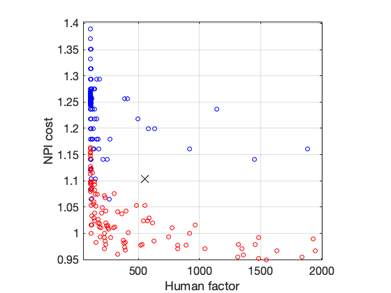
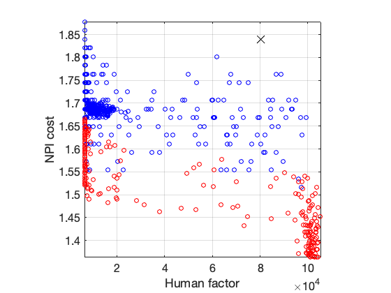
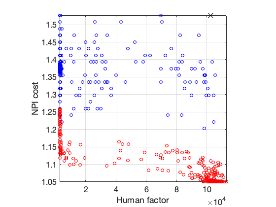
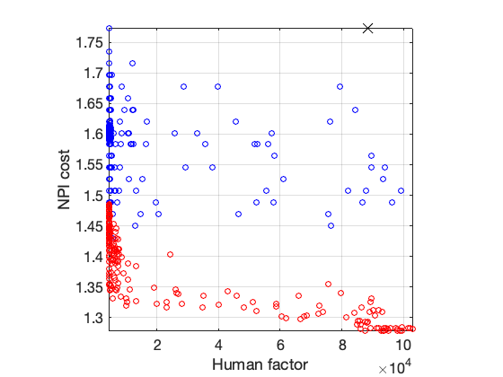
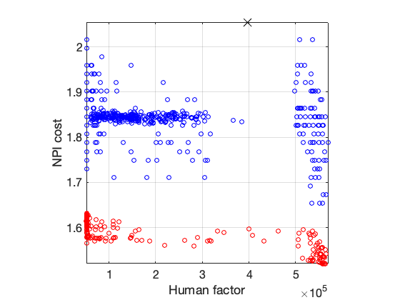
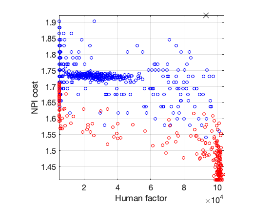
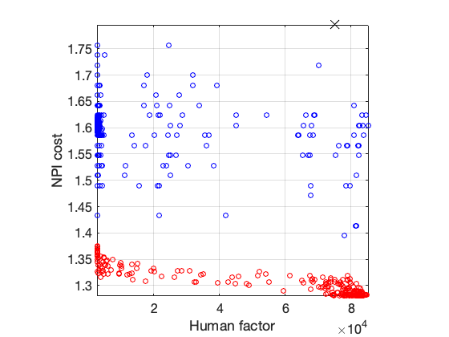
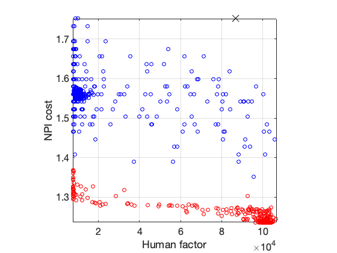
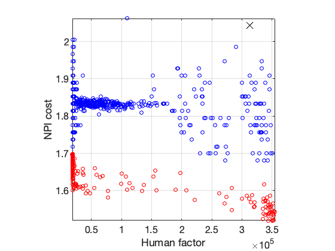

# Mathematical Modeling of Epidemic Diseases
## A Case Study of the COVID-19 Coronavirus
<!-- 
 -->
  
<!-- 
 -->
The Coronavirus COVID-19 has taken the lives of several thousands worldwide and locked-out many countries and regions, with yet unpredictable global consequences.
In this ongoing research we study the epidemic patterns of this virus from a mathematical modeling perspective.
The objective of this work is to provide researchers a better understanding of spreading patterns of such diseases and to clarify the common misunderstandings in this regard.
The latest version of a technical report on this research is available at: https://arxiv.org/abs/2003.11371. This Git repository is dedicated to sharing source codes for modeling and simulation of such epidemic diseases.

### The XPRIZE Pandemic Response Challenge
The repository also contains the models and MATLAB codes developed by the Alphanumerics Team, during the [XPRIZE Pandemic Response Challenge](https://www.xprize.org/challenge/pandemicresponse) for predicting future trends of the pandemic for different regions/countries using their previous trends and the non-pharmaceutical intervention (NPI) plans adopted in each region/country. Examples of such quantitative NPIs can be found in the [Oxford Covid-19 Government Response Tracker](https://github.com/OxCGRT/covid-policy-tracker). The second phase of the challenge was focused on the prescription of NPIs, which balance between human factors (new cases and fatality rate) and a weighted cost of the interventions. The Alphanumerics Team developed an algorithm based on *optimal estimation* and *finite horizon optimal control* to achieve this goal. The main MATLAB scripts developed by our team during Phase II of the Pandemic Response Challenge can be accessed through [testPrescribeXPRIZE02.m](testScripts/testPrescribeXPRIZE02.m). The theoretical details of our proposed methods are available in the following preprints:
- Sameni, R. (2021). Model-based prediction and optimal control of pandemics by nonpharmaceutical interventions. [arXiv preprint arXiv:2102.06609.](http://arxiv.org/abs/2102.06609)
- Sameni, R. (2020). Mathematical modeling of epidemic diseases; a case study of the COVID-19 coronavirus. [arXiv preprint arXiv:2003.11371.](https://arxiv.org/abs/2003.11371)

Please cite the above and the current repository, to refer to this work.

#### Sample Bi-objective Prescriptions
We can see below the bi-objective optimization space for sample countries. Blue: random NPI inputs (constant and variable over time); Black: fixed NPI (continuing with the latest policy); Red: optimal *Pareto efficient* input NPI for 250 values of the human vs NPI cost parameter. The model was trained over historic NPI of the Oxford dataset from Jan 1, 2020 to Feb 7, 2021 and tested over 120 days ahead using our Team's predictor data. *Note:* These results have been obtained fully automatically, without any country-wise tweaking.

|  |  |  |
| :---: | :---: | :---: |
| Afghanistan | France | Iran |
|  |  |  |
| Germany | Spain | Argentina |
|  |  |  |
| US | Italy | South Africa |
|  |  |  |
| UK | Brazil | China |
